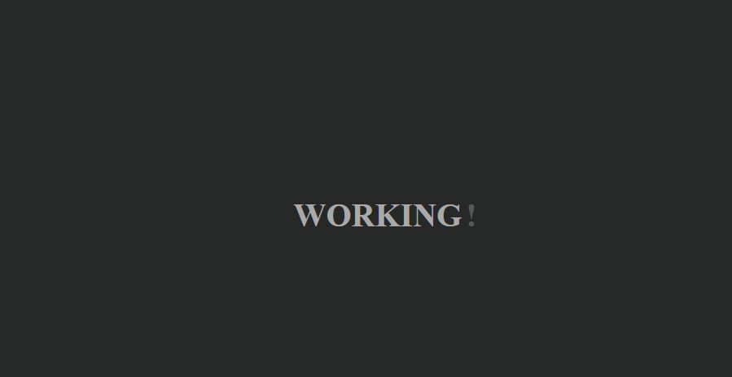

# WORKON

Projeto para responder um status code 200 com a mensagem "WORKING..."

## Criando os PODS

```bash
kubectl apply -f deployment.yaml
deployment.apps/workon-deployment created
```

## Listando os PODS

```bash
kubectl get pods
NAME                                 READY   STATUS    RESTARTS   AGE
workon-deployment-5f68d545f6-pmwbj   1/1     Running   0          22s
workon-deployment-5f68d545f6-q2gn5   1/1     Running   0          22s
```

## Expondo o projeto

```bash
kubectl port-forward deployment.apps/workon-deployment 8080:80
Forwarding from 127.0.0.1:8080 -> 80
Forwarding from [::1]:8080 -> 80
Handling connection for 8080
Handling connection for 8080
```

## Acessando via borwser

